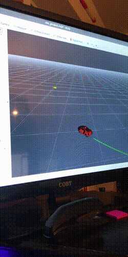
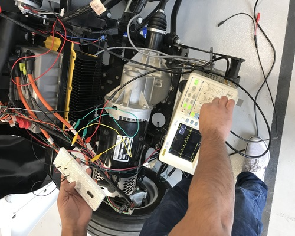
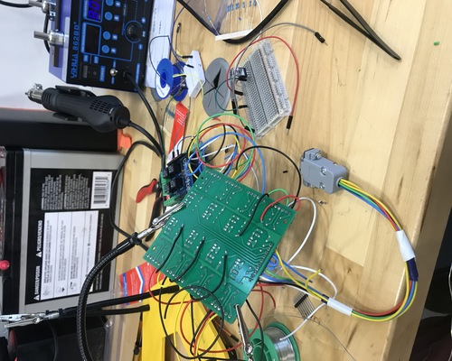
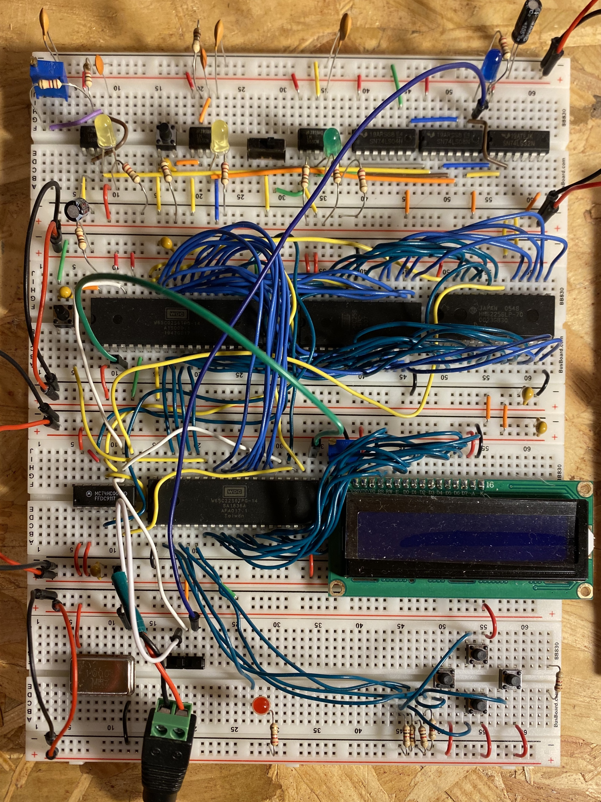

# About Me

My fondest experiences at Oakland University are the people I met and got to work with. I got to enjoy playing my favorite sport, hockey, with a great group of guys. My freshman year especially, I was out of my comfort zone playing with teammates two to four years older than me. That was a fantastic learning experience on communication and teamwork, and not to mention really fun. I also found comradery joining the Autonomous Vehicle Club. That club has a fantastic amount of diversity of thought, and it is a pleasure picking everyones brains. Another amazing thing about the club is the immense knowledge of my teammates. They are incredibly smart and an absolute pleasure to work with and learn from. In my free time, I find myself tinkering around with ROS, studying artificial intelligence, working on personal engineering projects, and playing hockey.

---

This webpage has 4 sections:

**Autonomous Vehicle Systems, Autonomous Vehicle Club, Machine Learning, Embedded Software**

##### Contact Infomation:
**LinkedIn:** <a href="https://www.linkedin.com/in/bengrudzien/">linkedin.com/in/bengrudzien</a>

**Email:**
 bgrudzien@oakland.edu
 
---

### Autonomous Vehicle Systems

This is called the "IGVC Course Challenge". My teamate and I Implemented the ROS Nav-Stack in C++ with SLAM and Dijkstra’s algorithm to navigate a robot autonomously through a course. In this case, the global costmap for the lanes is pre-generated and the local costmap generates in real-time to avoid course obstacles. Navigation goals were set in C++ which gave the robot a goal location.

Take a look at the "GPS waypoint Project". I programmed an algorithm in C++ to drive a car through 8 GPS waypoints in under 45 seconds. The algorithm utilizes the GPS coordinates of the waypoint, a reference GPS coordinate, and the heading of angle of the Audi R8 relative to the next waypoint for localization and navigation.

---

### Autonomous Vehicle Club

We had an event where high school students and their parents came to hear about our club. For this, we had point cloud information from the cars LiDAR on display in real-time.

This is a picutre of a teammate and I testing a voltage divider on an acceleration signal coming from the motor using an oscilloscope.

I hand soldered DV9 cables and our cars relay board based on a schematic we generated. This was crucial to get our drive by wire system completed.

---

### Machine Learning

I think sign language one

~~~python
model = tf.keras.models.Sequential([
    tf.keras.layers.Conv2D(64, (3,3), activation='relu', input_shape=(28, 28, 1)), # first convolution
    tf.keras.layers.MaxPooling2D(2, 2),
    tf.keras.layers.Conv2D(128, (3,3), activation='relu'), # second convolution
    tf.keras.layers.MaxPooling2D(2,2),
    tf.keras.layers.Flatten(),
    tf.keras.layers.Dropout(0.2), # Add dropout
    tf.keras.layers.Dense(512, activation='relu'), # 512 neurons
    tf.keras.layers.Dense(25, activation='softmax') # Multiclass set up   
])
~~~

course 4 maybe 

~~~python
lr_schedule = tf.keras.callbacks.LearningRateScheduler(
    lambda epoch: 1e-8 * 10**(epoch / 20))
~~~

~~~python
history = model.fit(train_set, epochs=100, callbacks=[lr_schedule])
~~~

course 1

~~~python
    class myCallback(tf.keras.callbacks.Callback):
        def on_epoch_end(self, epoch, logs={}):
            if (logs.get('acc') >= 0.99):
                print("\nReached 99% accuracy so cancelling training!")
                self.model.stop_training=True

    callbacks = myCallback()
~~~

~~~python
    history = model.fit(x_train, y_train, epochs=10, 
                        callbacks=[callbacks])
~~~

---

### Embedded Software

Based on YouTube tutorials done by Ben Eater, I built a 6502 based computer. There were two tutorials, one for a custom clock module using 555 timers, and another for the 6502 computer. I combined those both to on to one breadboard.

Another part of Ben Eater's tutorial was assembly programing. He taught me how to program the 6502 microcontroller and display text to a LCD display. I expaneded on his tutorial, in which he only worked on a breadboard, and converted it to a PCB.

---

