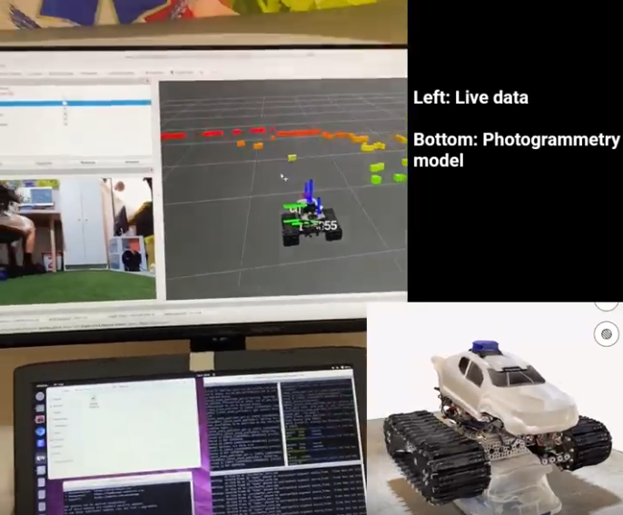
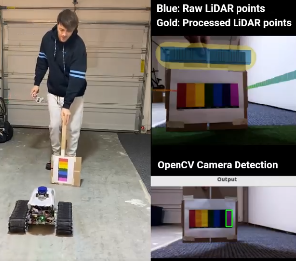
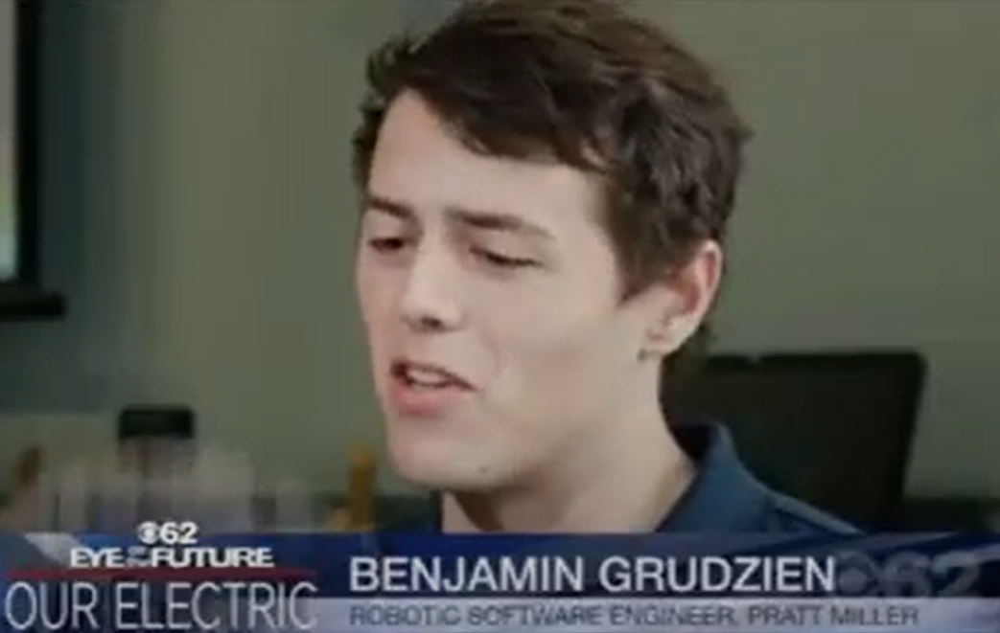
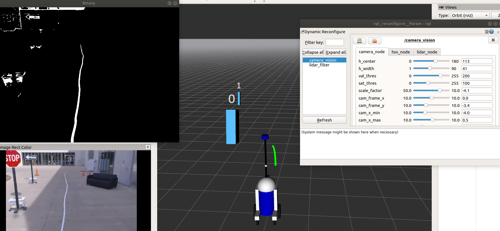
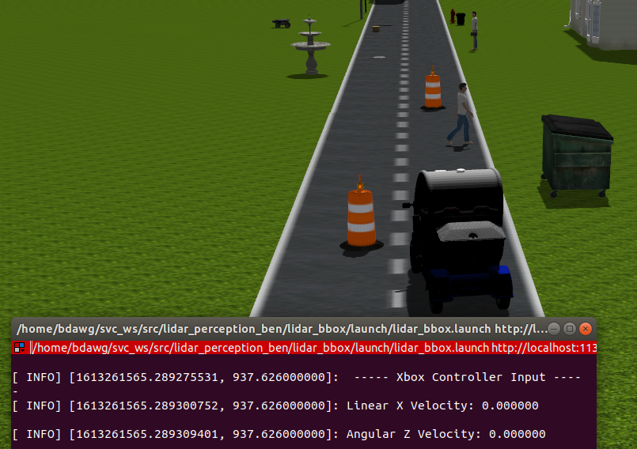
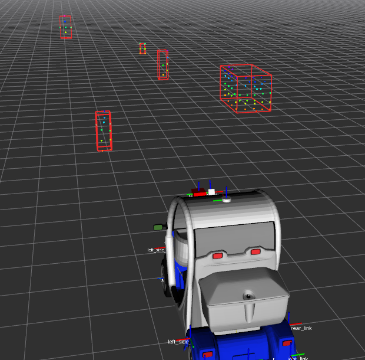
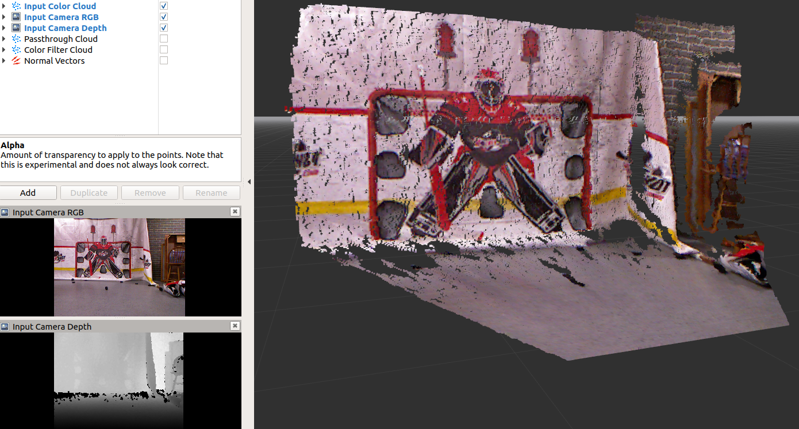
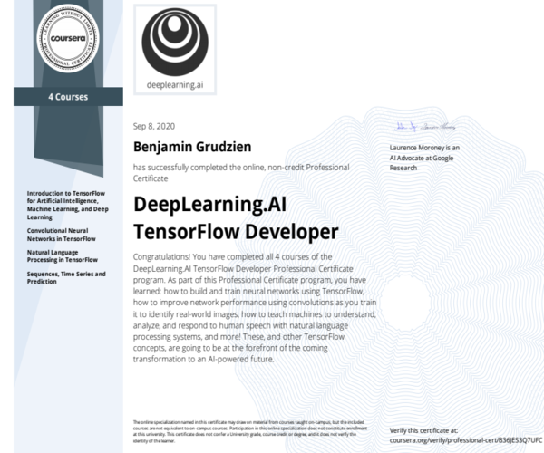

# About Me

**Pratt Miller (2021 - Present)**

I am an Unreal Engine simulation engineer with a deep background and professional experience in robotic autonomy 

**Oakland University (2016 - 2020)**

Experiences I had at OU taught me the value of stepping outside my comfort zone. I developed relationships with professors beyond class topics that provided me great insight into potential careers. My freshman year, I was the youngest player on OU’s hockey team. I was fortunate to have a physical outlet playing a sport I love while gaining friendships and confidence. In the Autonomous Vehicle Club, I earned a role as Vice President and gained experience collaborating with an intelligent and diverse team. 

**Webpage Sections:**

Unreal Engine Projects, Cyber Tank 5000, CBS TV Interview, Robotic Software Projects, Autonomous Vehicle Club, 6502 Computer, Machine Learning

### Social Media and Contact:
LinkedIn: <a href="https://www.linkedin.com/in/bengrudzien/">linkedin.com/in/bengrudzien</a>

GitHub: <a href="https://github.com/Grudz">github.com/Grudz</a>

Email:
 bengrudz88@gmail.com
 
---
# Unreal Engine Projects

TODO

---

# Cyber Tank 5000

About a year ago I decided I needed to learn ROS 2. I needed a robotic development platform to test autonomy algorithms and concepts

So I bought a tank chassis and motors from GoBilda, purchased a collection of autonomy sensors with open source ROS 2 drivers, and sourced parts for the body from Amazon and my local hobby shop

Key takeaways from this [video](https://www.linkedin.com/posts/bengrudzien_hey-network-about-a-year-ago-i-decided-activity-7155364778406776834-RtUO?utm_source=share&utm_medium=member_desktop) are:
- Holistic robot development from hardware to software
- Wireless live data viewing

- Autonomy sensor calibration
- Photogrammetry utilization
- Autonomous takeover for collision avoidance during teleoperation
- Leader-follower autonomy powered by camera x LiDAR fusion

**Link to video:** [Cyber Tank 5000](https://www.linkedin.com/posts/bengrudzien_hey-network-about-a-year-ago-i-decided-activity-7155364778406776834-RtUO?utm_source=share&utm_medium=member_desktop)

---

# CBS TV Interview

I was in a video that the Autonomous Vehicle Club made for ABET accreditation funding. Sometime after I graduated from OU, CBS reached out and said they liked my energy in that video and wanted to interview me for their next segment. Here is a clip from that interview: I was asked questions on the spot regarding the future of electrification in engineering.

**See me in advertisment (8:36):** [CBS Article](https://detroit.cbslocal.com/2021/10/31/michigan-matters-education-in-the-spotlight/)

**Youtube link to portion of my interview (1:06):**

  

---

## Robotic Software Projects

I took a rosbag file of an autonomus golf cart, then used class examples to piece together a cool project. This demonstrates lidar and camera processing in ROS using OpenCV and the PCL library. 

The lidar returns intensity of points and that was used place bounding boxes on the sign posts. The monocular camera is used to track the line of tape on the ground. The camera image is processed to get 3D information and place PCL points on the tape. Then a line is projected to fit those points. Oh and also I added the iconic R3D3 (upgrade from R2D2) to this project :)

This project is called "LiDAR n' Xbox". Why is it named that? This project demonstrates lidar processing using the PCL library and generating bounding boxes based on that data. Also, I created a fun world in Gazebo and can drive my golf cart around that world with my Xbox controller testing my perception algorithm.

**"What People See"** - Gazebo

**"What the Car Sees"** - Rviz

This next project is called the "IGVC Course Challenge". My teamate and I Implemented the ROS Nav-Stack in C++ with Dijkstra’s algorithm to navigate a robot autonomously through a course. In this case, the global costmap for the lanes is pre-generated and the local costmap generates in real-time to avoid course obstacles. Navigation goals were set in C++ which gave the robot a goal location.

Take a look at the "GPS waypoint Project". This project demonstrates an autonomous vehicle localization algorithm. This algorithm utilizes the latitude and longitude of 8 GPS waypoints. I converted those locations to UTM coordinates. Then, I localized the autonomous Audi R8 based on a reference UTM coordinate, the location of the waypoint, and the location of the car. With these locations I was able to create vectors and find the angle of the car relative to the next waypoint. 

I'm currently working on this project. I plan to use an Xbox 360 Kinect to register how many goals I scored shooting pucks at a tarp in my basement. A screenshot of a rosbag file I took in rviz is shown below.

---

## Autonomous Vehicle Club

The GIF below shows a cool demonstration of the ROS simulation for the Autonomous Vehicle Club. You can see visuals for the LiDAR and Camera topics from our cool golf cart.

We had an event where high school students and their parents came to hear about our club. For this, we had point cloud information from the cars LiDAR on display in real-time.

This is a picutre of a teammate and I testing a voltage divider on an acceleration signal coming from the motor using an oscilloscope.

I hand soldered DB9 cables and our cars relay board based on a schematic we generated. This was crucial to get our drive by wire system completed.

---

## 6502 Computer

Based on YouTube tutorials done by Ben Eater, I built a 6502 based computer. There were two tutorials, one for a custom clock module using 555 timers, and another for the 6502 computer. I combined those both on to one breadboard.

Another part of Ben Eater's tutorial was assembly programing. He taught me how to program the 6502 microcontroller and display text to a LCD display. I expaneded on his tutorial, in which he only worked on a breadboard, and converted it to a PCB. (Plus it was way easier to program the ROM this way, because I didn't have to worry about accidently pulling any wires out on the breadboard)

---

## Machine Learning

This summer I completed four TensorFlow courses on Coursea and earned the Deeplearning.AI TensorFlow Developer Specialization. The courses I completed were "Introduction to TensorFlow for Artificial Intelligence, Machine Learning, and Deep Learning", "Convolutional Neural Networks in TensorFlow", "Natural Language Processing in TensorFlow", and "Sequences, Time Series and Prediction". 

<a href="https://coursera.org/share/6afb226e61e1776eb9c04fb6f5fe602b">Certificate Validation Link</a>

This is a multilass deep neural network I made to recoginze sign lanugae images for each letter of the alphabet. This is a sequential neural network (NN) meaning the layers appear in the order that they are declared. This NN has two convolutional layers. The first convolution has 64 image filters and an input shape of 28x28 pixels in grayscale. The pooling layer basically simplifies the convolution layer's output and keeps the most impactful pixels. The activation function 'relu' stands for rectified linear unit, all this really does is ignore negative values that appear. Convolutions are in a matrix like data structure, so the flatten layer converts that into a vector to feed into the dense layers neurons. The dropout layer lets the NN ignore neurons if it thinks that they are too bias. Finally, the 'softmax' activation function is used at the output layer because this is multiclass NN. If the output desired was a yes or no answer, I would have used a 'sigmoid' activation function.

~~~python
model = tf.keras.models.Sequential([
    tf.keras.layers.Conv2D(64, (3,3), activation='relu', input_shape=(28, 28, 1)), # first convolution
    tf.keras.layers.MaxPooling2D(2, 2),
    tf.keras.layers.Conv2D(128, (3,3), activation='relu'), # second convolution
    tf.keras.layers.MaxPooling2D(2,2),
    tf.keras.layers.Flatten(),
    tf.keras.layers.Dropout(0.2), # Add dropout
    tf.keras.layers.Dense(512, activation='relu'), # 512 neurons
    tf.keras.layers.Dense(25, activation='softmax') # Multiclass set up   
])
~~~

This is an interesting use of callbacks. This function changes the learning rate per every epoch. Then after the model is trained at a bunch of different learning rates, I graphed the epochs vs the learning rate and discovered the optimal learning rate for my model's optimizer.

~~~python
lr_schedule = tf.keras.callbacks.LearningRateScheduler(
    lambda epoch: 1e-8 * 10**(epoch / 20))
~~~

~~~python
history = model.fit(train_set, epochs=100, callbacks=[lr_schedule])
~~~

This is an example of another helpful callback. This code stoped training my model once the desired accuracy was reached. For example, even if the model is at epoch 10 out of 30, if the desired accuracy has been reached, the model will stop getting trained.

~~~python
    class myCallback(tf.keras.callbacks.Callback):
        def on_epoch_end(self, epoch, logs={}):
            if (logs.get('acc') >= 0.99):
                print("\nReached 99% accuracy so cancelling training!")
                self.model.stop_training=True

    callbacks = myCallback()
~~~

~~~python
    history = model.fit(x_train, y_train, epochs=10, 
                        callbacks=[callbacks])
~~~

---

