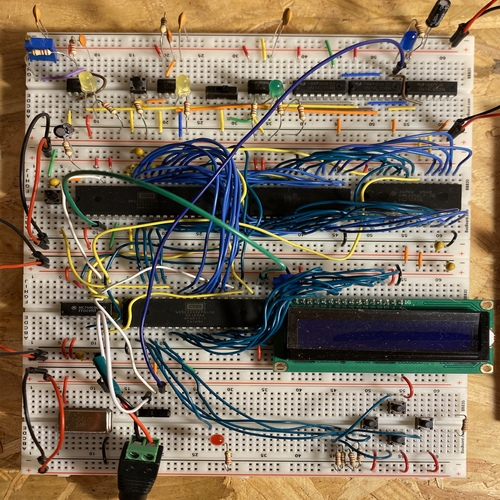

# About Me

I am Vice President of Oakland University's Autonomous Vehicle Club. I played 3 years of hockey at Oakland university and I have one and a half years of professional automotive engineering experience. Learning about the Robot Operating System (ROS) and applying it to autonomous vehicles and robots is fascinating. In my free time, I like to learn about artificial intelligence, work on personal engineering endeavors, and play hockey.

---

This webpage has 4 sections:

**Autonomous Vehicle Systems, Autonomous Vehicle Club, Machine Learning, Embedded Software**

##### Contact Infomation:
**LinkedIn:** <a href="https://www.linkedin.com/in/bengrudzien/">linkedin.com/in/bengrudzien</a>

**Email:**
 bgrudzien@oakland.edu
 
---

### Autonomous Vehicle Systems

IGVC Course Challenge

GPS waypoint project

---

### Autonomous Vehicle Club

---

### Machine Learning

I think sign language one

~~~python
model = tf.keras.models.Sequential([
    tf.keras.layers.Conv2D(64, (3,3), activation='relu', input_shape=(28, 28, 1)), # first convolution
    tf.keras.layers.MaxPooling2D(2, 2),
    tf.keras.layers.Conv2D(128, (3,3), activation='relu'), # second convolution
    tf.keras.layers.MaxPooling2D(2,2),
    tf.keras.layers.Flatten(),
    tf.keras.layers.Dropout(0.2), # Add dropout
    tf.keras.layers.Dense(512, activation='relu'), # 512 neurons
    tf.keras.layers.Dense(25, activation='softmax') # Multiclass set up   
])
~~~

course 4 maybe 

~~~python
lr_schedule = tf.keras.callbacks.LearningRateScheduler(
    lambda epoch: 1e-8 * 10**(epoch / 20))
~~~

~~~python
history = model.fit(train_set, epochs=100, callbacks=[lr_schedule])
~~~

course 1

~~~python
    class myCallback(tf.keras.callbacks.Callback):
        def on_epoch_end(self, epoch, logs={}):
            if (logs.get('acc') >= 0.99):
                print("\nReached 99% accuracy so cancelling training!")
                self.model.stop_training=True

    callbacks = myCallback()
~~~

~~~python
    history = model.fit(x_train, y_train, epochs=10, 
                        callbacks=[callbacks])
~~~

---

### Embedded Software

breadboard

gif

---

